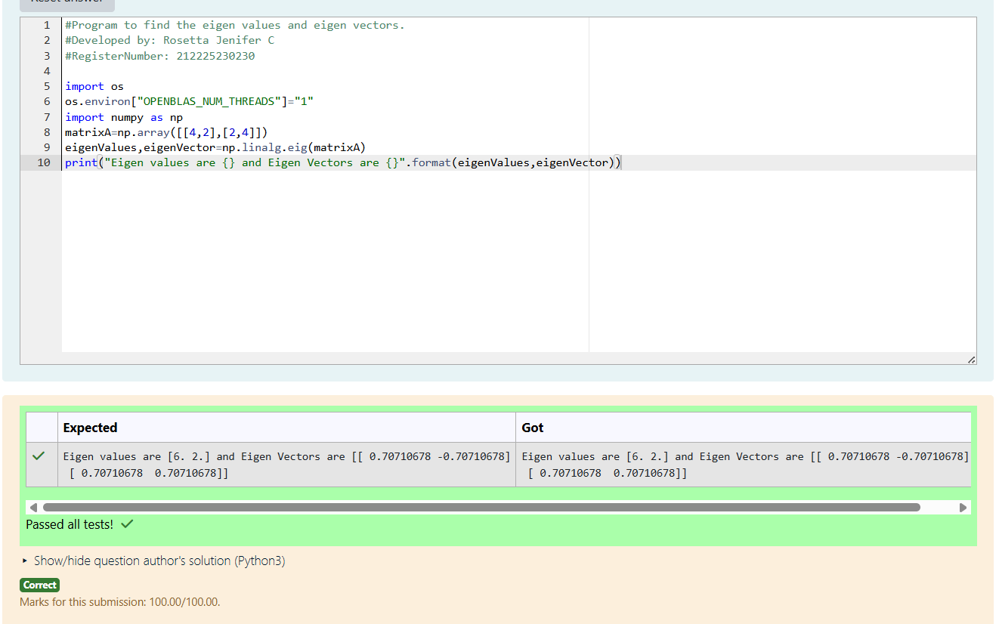

# EIGENVALUES-AND-EIGENVECTORS
## Aim:
To write a python program to find the Eigenvalues and Eigen Vectors
## Equipment’s required:
1. 	Hardware – PCs
2. 	Anaconda – Python 3.7 Installation / Moodle-Code Runner
## Algorithm:
### Step1 : 
Import numpy library using import numpy as np.
### Step 2: 
Define the matrix using np.array().
### Step 3:
 Using the np.linalg.eig(),  we get two results (first is eigenvalue and second is eigenvector) of the given matrix.
### Step 4: 
Print the Eigenvalues and Eigenvectors.

## Program:
```
#Program to find the eigen values and eigen vectors.
#Developed by: Rosetta Jenifer C
#RegisterNumber: 212225230230

import os
os.environ["OPENBLAS_NUM_THREADS"]="1"
import numpy as np
matrixA=np.array([[4,2],[2,4]])
eigenValues,eigenVector=np.linalg.eig(matrixA)
print("Eigen values are {} and Eigen Vectors are {}".format(eigenValues,eigenVector))
```

## Output:

## Result:
Thus the Eigenvalue and Eigenvector is successfully solved using python program
